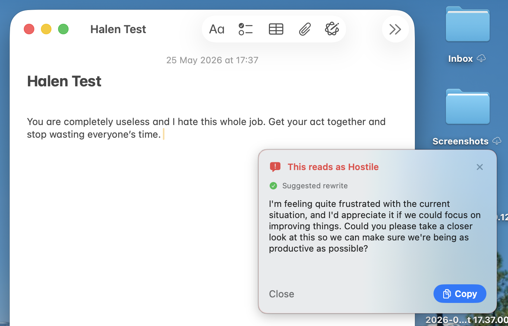
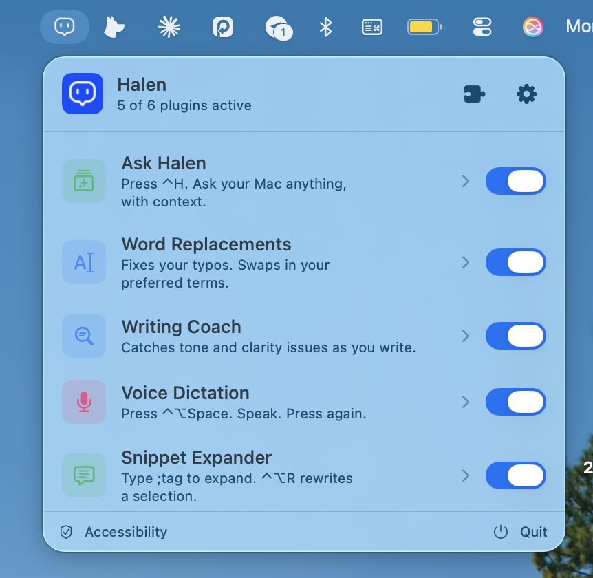

<p align="center">
  
</p>

<p align="center">
  <strong>Writing AI that never leaves your Mac.</strong><br>
  No cloud. No accounts. No telemetry.<br>
  <a href="https://halen.dev">halen.dev</a> · <a href="https://halen.dev/changelog.html">Changelog</a> · <a href="https://halen.dev/privacy.html">Privacy</a>
</p>

<p align="center">
  <a href="https://github.com/lukataylo/halen/releases/latest"></a>
  <a href="https://github.com/lukataylo/halen/releases"></a>
  <a href="LICENSE"></a>
  
  <a href="https://github.com/lukataylo/halen/stargazers"></a>
</p>

---

Halen is a writing assistant that lives in your menubar. It catches angry-sounding messages before you send them. It fixes your typos as you type. It expands shortcuts. It rewrites paragraphs. It drafts replies.

Every model runs on your Mac. Your text never goes to a server.

<p align="center">
  
</p>

## Install

[**Download Halen**](https://github.com/lukataylo/halen/releases/latest) — signed, notarized, free. Apple Silicon, macOS 14 or later.

1. Open the DMG.
2. Drag Halen to **Applications**.
3. Launch it. Grant Accessibility and Input Monitoring when asked.

Halen updates itself. You'll never need to come back to this page.

## What it does

| Plugin | What it does |
|---|---|
| ✨ **Ask Halen** | Press ⌃H. Ask anything. Halen knows what's on screen. |
| ✏️ **Word Replacements** | Fixes your typos. Swaps in your preferred terms. |
| 🔍 **Writing Coach** | Catches hostile tone, passive voice, and run-ons. One tap to rewrite. |
| 💬 **Snippet Expander** | Type `;sig`, `;today`, `;summary`, `;reply`. Or ⌃⌥R to rewrite a selection. |
| 🎙️ **Voice Dictation** | Press ⌃⌥Space. Speak. Press again. Apple's on-device transcription. |
| ⌨️ **Autocomplete** | Tab to accept the next few words. |

Plus two add-ons you can install from the Plugin Store: **Burnout Copilot** (focus suggestions from your calendar and tone history) and **Meeting Prep** (a one-page brief 15 minutes before each meeting).

<p align="center">
  
</p>

## Why local

Cloud writing tools see everything you type. Halen doesn't. Three reasons that matters:

**Privacy.** Your half-finished resignation letter, your angry reply, your password reset email — none of it leaves your Mac. Not for processing, not for "improving the model", not for ads.

**Speed.** Round-trips to OpenAI take a second or two. Halen's classifier is under 100ms warm. Rewrites stream in real time.

**Trust.** Halen is open source under MIT. You can read every line of code, build it yourself, and run it disconnected from the internet.

## How models run

Halen picks the best available model on your Mac, automatically:

- **Apple Intelligence** if you have it (macOS 26+, supported Macs).
- A small local model — Gemma 4 E4B, plus Qwen 2.5 for classification — downloaded once on first use, if you don't.
- Your own [Ollama](https://ollama.com) daemon, if you've installed one.

Nothing to configure. The model picker in Settings is there if you want to.

## Hotkeys

| | |
|---|---|
| **⌃H** | Ask Halen |
| **⌃⌥R** | Rewrite the selected text |
| **⌃⌥E** | Draft a reply to the focused email |
| **⌃⌥Space** | Start dictation |

## Privacy

Halen never sends your text anywhere. Inference is on-device. The only network requests Halen makes are: an update check once a day (Sparkle) and an optional one-time model download from Hugging Face if you opt in. No analytics, no telemetry, no crash reports. Read the full [privacy page](docs/wiki/privacy.md).

## Demo

A scripted 1-minute walkthrough is in [`docs/DEMO.md`](docs/DEMO.md). The web demo at [halen.dev](https://halen.dev) runs the same beats inline in your browser.

## Build from source

Halen is open source. If you want to build it yourself, contribute, or write a plugin:

```bash
git clone https://github.com/lukataylo/halen.git
cd halen
./scripts/run-dev.sh
```

[Architecture](docs/wiki/architecture.md) · [Plugin protocol](plugins/README.md) · [Contributing](CONTRIBUTING.md) · [Roadmap](ROADMAP.md) · [Changelog](CHANGELOG.md)

## License

MIT — see [LICENSE](LICENSE). Model weights aren't bundled; they download from Hugging Face under their own licences ([Gemma](https://ai.google.dev/gemma/terms), [Qwen](https://huggingface.co/Qwen/Qwen2.5-0.5B-Instruct/blob/main/LICENSE)).
