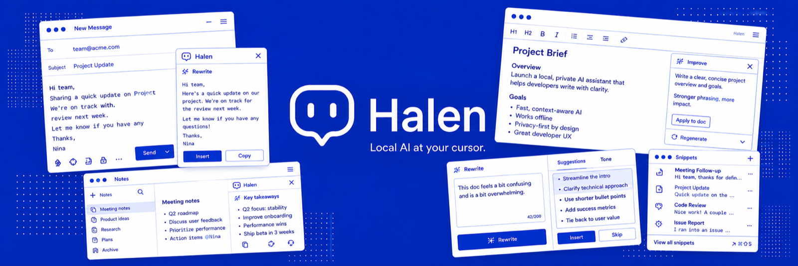

<p align="center">
  
</p>

<p align="center">
  <strong>Writing AI that never leaves your Mac.</strong><br>
  No cloud. No drafts uploaded. No accounts.<br>
  <a href="https://halen.dev">halen.dev</a> · <a href="https://halen.dev/changelog.html">Changelog</a> · <a href="https://halen.dev/privacy.html">Privacy</a>
</p>

<p align="center">
  <a href="https://github.com/lukataylo/halen/actions/workflows/ci.yml"></a>
  <a href="https://github.com/lukataylo/halen/releases/latest"></a>
  <a href="https://github.com/lukataylo/halen/releases"></a>
  <a href="LICENSE"></a>
  
  
  <a href="https://github.com/lukataylo/halen/stargazers"></a>
</p>

---

Writing tools moved to the cloud while you weren't looking.

Halen is the move back. A menubar app that watches the text near your cursor and runs a set of small, focused **plugins** against it. Fix typos as you type. Rewrite a paragraph in a friendlier tone. Catch a sentence before you send it in anger.

Every plugin runs locally. Typo correction is a personal dictionary; tone classification is Qwen 2.5 0.5B; rewrites go through Gemma 4 E4B on llama.cpp. Inference routes across whatever's available on your Mac — Apple Intelligence, the bundled models, or your own [Ollama](https://ollama.com) daemon.

The text never leaves your Mac. Not as a feature. As a default.

## Install

[**Download Halen.dmg**](https://github.com/lukataylo/halen/releases/download/v0.1.0-alpha/Halen.dmg) — signed, notarized, drag-to-Install. Apple Silicon Mac, macOS 14 or later.

1. Double-click the DMG to mount it.
2. Drag `Halen.app` to **Applications**.
3. Open Halen. Grant **Accessibility** and **Input Monitoring** when it asks — these are the two permissions every plugin depends on, and onboarding walks you through them.

Halen auto-updates via Sparkle. Future versions install in place; no need to re-download from this page.

> Building from source instead? Jump to [Build from source](#build-from-source).

## What's in the box

Ten plugins ship with Halen out of the box. Each one is a small Swift module conforming to `HalenPlugin`; the marketplace dropdown lets you toggle them on/off and dive into per-plugin settings. A few default to off — onboarding walks you through what to enable.

| Plugin | Category | Default | What it does |
|---|---|---|---|
| **Ask Halen** | Productivity | On | Press ⌃H anywhere. A floating palette opens with your focused app, selected text, and recent clipboard already in context — ask a one-shot question and the answer is inserted at your cursor. |
| **Typo Fixer** | Writing | On | Replaces your known typos inline as you type. Seeded with a personal dictionary of 32 frequent slips; learns new ones automatically from your edits. Backspace + retype to "undo" a bad correction — it demotes the entry forever. |
| **Sentiment Guard** | Writing | On | When you finish a sentence in any text field, a local classifier judges the tone against rules you control (5 built-in + add your own). Hostile or irritated? Halen shows a popover asking whether to send anyway or have Gemma 4 rephrase it. |
| **Snippet Expander** | Productivity | On | Type `;sig` or `;today` or `;summary` followed by a space — Halen swaps it for static text, computed values, or a Gemma-generated rewrite of whatever you wrote above. Add your own with custom Gemma prompts. Also: select text anywhere and press ⌃⌥R to rewrite just that selection in place. |
| **Clarity Checker** | Writing | On | Flags passive voice, run-on sentences, and vague phrasing as you finish each paragraph. One-tap rewrite via Gemma 4. |
| **Voice Dictation** | Voice | Off | Press ⌥⌘H anywhere. A live waveform pill follows your cursor while you speak. Apple's on-device speech recognition transcribes locally; the text lands at the caret on stop. |
| **Inline Autocomplete** | Writing | Off | Suggests the next few words as ghost text after each pause. Tab to accept. Off by default because it's a continuous interruption — opt in if you want it. |
| **Personal Style Guide** | Writing | Off | Your own banned-words → preferred-words list, scanned per paragraph. Catches the words *you* don't want to use, with one-tap replacement. |
| **Email Reply** | Productivity | Off | Press ⌃⌥E while reading an email to draft a reply with Gemma 4, in the tone you pick. |
| **Tone Profiles** | Writing | Off | Tell Halen which apps you write formally in (Mail, Outlook) and which you don't (Slack, iMessage). Other writing plugins use this hint to calibrate their suggestions. |

External plugins live under `~/Library/Application Support/Halen/Plugins/` and communicate via JSON-RPC over stdio. **Burnout Copilot** (focus suggestions from app usage + calendar density + tone trend) and **Meeting Prep** (Gemma-written briefing 15 min before each event) ship in this repo under [`plugins/`](plugins/) and show up in the marketplace alongside the bundled set once installed.

## How it works

```
┌──────────────────────────────────────────────────────────────────┐
│                       HALEN MENUBAR APP                          │
│                                                                  │
│  CaretObserver ──┐                                               │
│  (AX events)     │                                               │
│                  ▼                                               │
│              EventBus ──► text.pause, caret.moved, ...           │
│                  │                                                │
│   ┌──────┬──────┬┴─────┬──────┬──────┬──────┬──────┬─────┬─────┐ │
│   ▼      ▼      ▼      ▼      ▼      ▼      ▼      ▼     ▼     ▼ │
│  Ask   Typo  Sentim. Snippet Clarity Voice  Auto-  Style Email Tone
│  Halen Fixer  Guard  Expand. Checker Dict.  compl. Guide Reply Prof.│
│   │     │      │      │      │      │      │      │     │     │  │
│   └──┬──┴──────┴──────┴──────┴──────┴──────┴──────┴─────┴─────┘  │
│      │                                                            │
│      │   External plugins (JSON-RPC over stdio)                   │
│      │   ┌─ Burnout Copilot ─┐                                    │
│      ├──►│ Meeting Prep      │  ~/Library/.../Halen/Plugins/      │
│      │   └─ (your own…)    ──┘                                    │
│      ▼                                                            │
│   RouterInferenceClient ──┬──► Apple Foundation Models            │
│   (picks per request,     ├──► bundled Gemma 4 on llama.cpp       │
│    falls through on fail) ├──► Qwen 2.5 0.5B for classification   │
│                           └──► Ollama on localhost:11434          │
└──────────────────────────────────────────────────────────────────┘
```

- **Host (this app)** owns macOS Accessibility caret tracking, the event bus, the multi-backend inference router, persistent storage, the auto-updater (Sparkle), and the SwiftUI menubar UI.
- **Plugins** subscribe to events on the bus, optionally call inference, and write back to the focused text field via AX. Ten ship in-process; two more (`burnout-copilot` and `meeting-prep`) ship as **out-of-process JSON-RPC plugins** under [`plugins/`](plugins/), loaded through the same `ExternalPluginAdapter` any third-party plugin uses. The contract is identical: `text.pause` event names line up between in-process and over-the-wire. A loopback WebSocket bridge speaks the same surface to the browser extension.
- **Inference** goes through `RouterInferenceClient`, which routes each request to the best available backend and falls through to the next on failure. Backends shipped: **Apple Foundation Models** (macOS 26+, zero install), a **bundled Gemma 4 E4B model on llama.cpp** for the `.medium`/`.large` tiers, a **bundled Qwen 2.5 0.5B classifier** for the `.classifier` tier (sub-100 ms warm tone scans), and your local **Ollama** daemon (opt-in). Plugins request a tier (`classifier` / `small` / `medium` / `large`) and a task kind; the host picks the backend and model. Order is user-configurable in Settings.

Full architecture and per-plugin internals: see [`docs/wiki/`](docs/wiki/).

## Build from source

**Prerequisites**
- macOS 14 Sonoma or later, Apple Silicon
- Xcode command-line tools (`xcode-select --install`)
- An inference backend. Halen picks whatever's available, so any one of:
  - **Apple Intelligence** (macOS 26+) — nothing to install.
  - The **bundled Gemma 4 E4B model** — fetched on first use by the in-app downloader (Settings → Inference), or baked into the `.app` with `BUNDLE_MODEL=1`.
  - **[Ollama](https://ollama.com)** with `gemma4:e4b` and optionally `gemma4:e2b`:
    ```bash
    ollama pull gemma4:e4b
    ollama pull gemma4:e2b   # smaller / faster
    ```

**Build and launch**
```bash
git clone https://github.com/lukataylo/halen.git
cd halen
./scripts/run-dev.sh
```

`run-dev.sh` calls `build-app.sh` (which builds the SPM target, assembles `build/Halen.app`, embeds `llama.framework` and `Sparkle.framework`, and signs with your Apple Development cert so TCC permissions persist across rebuilds), quits any prior instance, launches the app, and streams its log.

For a release build, [`docs/RELEASING.md`](docs/RELEASING.md) walks through the four-script chain (`build-app.sh` → `notarize.sh` → `package-dmg.sh` → `publish-release.sh`) that produces a signed, notarized, drag-to-Install DMG and an updated Sparkle appcast.

**Grant permissions** (Halen's onboarding walks through these on first launch)
1. **Accessibility** — Halen needs this to see and modify text. *Without it, no plugin works.*
2. **Input Monitoring** — for global hotkeys like `⌃H` (Ask Halen) and `⌃⌥R` (rephrase selection).
3. **Microphone + Speech Recognition** — requested the first time you turn on Voice Dictation.
4. **Calendar + Notifications** — requested by Burnout Copilot and Meeting Prep when you install them from the Plugin Store.

## Privacy

Everything that processes your text — typo matching, tone classification, snippet expansion, dictation — runs **locally on your machine**. Inference stays on-device whether it goes to Apple Foundation Models, the bundled Gemma 4 model, or your local Ollama daemon (HTTP to `localhost:11434`). The only other network traffic Halen can generate is a one-time download of the bundled model from Hugging Face, if you opt into it from Settings. No telemetry, no analytics, no error reporting calls. The `docs/wiki/privacy.md` page goes through this in detail.

## Demo

A scripted **1-minute demo** is in [`docs/DEMO.md`](docs/DEMO.md). Beat-by-beat: typo correction → sentiment popover → ;casual rewrite → meeting prep briefing.

The web demo at [halen.dev](https://halen.dev) runs the same four beats inline in your browser.

## Repository layout

```
Sources/Halen/
├── App/                 # SwiftUI App, AppCoordinator, marketplace UI,
│                        #   settings, onboarding, Sparkle updater wrapper
├── Plugins/             # HalenPlugin protocol, PluginRegistry, HalenServices,
│                        #   out-of-process plugin host + WebSocket bridge
├── Features/            # the ten in-process plugins, one folder each
├── Accessibility/       # AX permission flow, caret/focused-element observer
├── Inference/           # RouterInferenceClient, backends (Apple FM, llama.cpp,
│                        #   Ollama), tiers, model downloader
├── Events/              # in-process EventBus + Codable event payloads
├── Overlay/             # caret-following indicator window + inline underlines
└── Support/             # Log, string diff, Levenshtein, paragraph classifier

Tests/HalenTests/        # 117 unit tests (router, event bus, manifests,
                         #   paragraph classifier, style rules, …)
plugins/                 # Out-of-process JSON-RPC plugins:
                         #   burnout-copilot · meeting-prep
                         #   plus preview ports of style-guide / email-reply /
                         #   autocomplete / tone-profiles (v0.3.0 cutover)
Resources/               # AppIcon.icns, menubar template, Info.plist,
                         #   entitlements, source SVG
Vendor/                  # pinned llama.cpp xcframework + version pin
docs/                    # README hero, landing-page assets, wiki,
                         #   RELEASING.md, PLUGIN_EXTRACTION.md, DEMO.md
scripts/                 # build-app.sh · run-dev.sh · fetch-assets.sh
                         # notarize.sh · package-dmg.sh · publish-release.sh
                         # reset-permissions.sh · generate-icons.swift
```

## Build, test, CI

`swift build` / `swift test` from the repo root. The suite is 117 tests under
`Tests/HalenTests/`. [`.github/workflows/ci.yml`](.github/workflows/ci.yml)
runs `swift build` + `swift test` + a release-config build on every push and
PR to `main`, on a macOS 14 runner. CI status is the badge at the top.

## Contributing

We welcome contributions. See [`CONTRIBUTING.md`](CONTRIBUTING.md) for setup,
code style, and how to propose a change. Be kind in issues and PRs;
disagreement is fine, dismissiveness isn't.

The roadmap lives at [`ROADMAP.md`](ROADMAP.md); the changelog at
[`CHANGELOG.md`](CHANGELOG.md).

Writing a plugin? Halen's external plugin protocol (JSON-RPC over stdio) is
documented in [`plugins/README.md`](plugins/README.md). The two reference
plugins, `burnout-copilot` and `meeting-prep`, are both ~100 lines of Python
each.

## License

MIT — see [`LICENSE`](LICENSE). Gemma 4 is governed by Google's
[Gemma terms](https://ai.google.dev/gemma/terms); Qwen 2.5 by Alibaba's
[Qwen license](https://huggingface.co/Qwen/Qwen2.5-0.5B-Instruct/blob/main/LICENSE).
Model weights are not redistributed in this repository — they download on
demand from Hugging Face.
