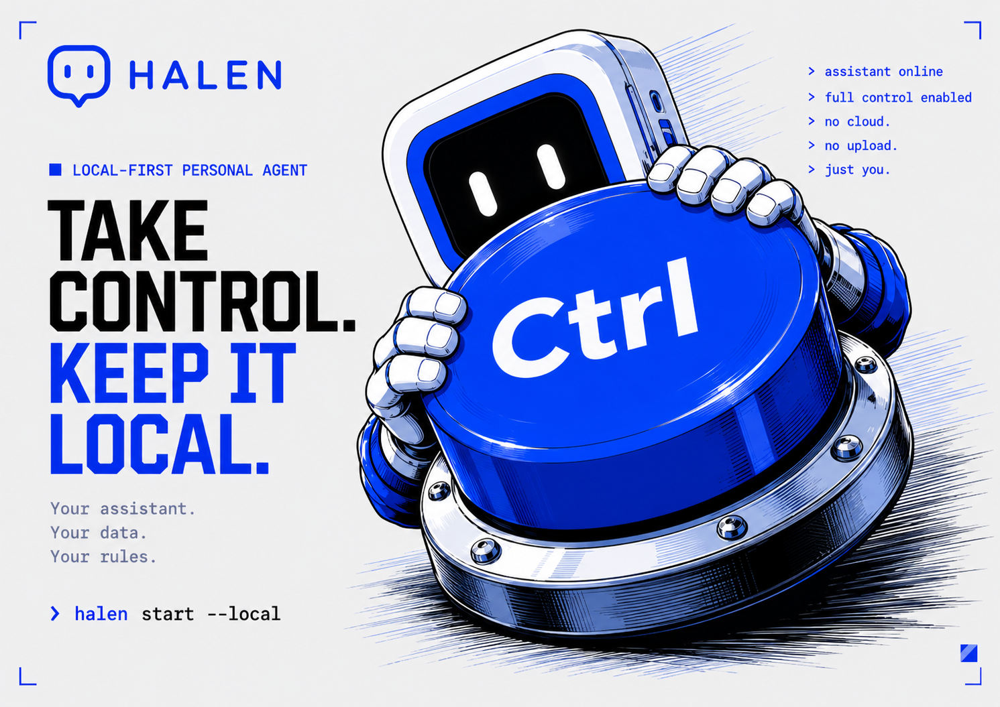

<p align="center">
  
</p>

<h1 align="center">Halen</h1>

<p align="center">
  <strong>Local-first writing agent for macOS.</strong><br>
  No cloud. No upload. Just you, your data, your rules.<br>
  <a href="https://halen.dev">halen.dev</a>
</p>

---

Halen is a menubar app that watches the text near your cursor and runs a set of small, focused **plugins** against it. Every plugin runs locally — typo correction is a static dictionary; everything else goes through your own [Gemma 4](https://blog.google/innovation-and-ai/technology/developers-tools/gemma-4/) instance via [Ollama](https://ollama.com). The text never leaves your Mac.

## What's in the box

Six plugins ship with Halen out of the box. Each one is a small Swift module conforming to `HalenPlugin`; the marketplace dropdown lets you toggle them on/off and dive into per-plugin settings.

| Plugin | Category | What it does |
|---|---|---|
| **Typo Fixer** | Writing | Replaces your known typos inline as you type. Seeded with a personal dictionary of 32 frequent slips; learns new ones automatically from your edits. Backspace + retype to "undo" a bad correction — it demotes the entry forever. |
| **Sentiment Guard** | Writing | When you finish a sentence in any text field, Gemma 4 E4B classifies the tone against a set of rules you control (5 built-in + add your own). Hostile or irritated? Halen shows a popover asking whether to send anyway or have Gemma rephrase to your clipboard. |
| **Voice Dictation** | Voice | Press ⌥⌘Space anywhere. A live waveform pill follows your cursor while you speak. Apple's on-device speech recognition transcribes locally; the text lands at the caret on stop. |
| **Snippet Expander** | Productivity | Type `;sig` or `;today` or `;summary` followed by a space — Halen swaps it for static text, computed values, or a Gemma-generated rewrite of whatever you wrote above. Add your own with custom Gemma prompts. |
| **Burnout Copilot** | Focus | Watches three signals — time in distraction apps, recent tone trend, calendar density — and pops a *"Take 10?"* suggestion when 2 of 3 trip. One click creates a calendar break and triggers your Focus Shortcut. |
| **Meeting Prep** | Scheduling | 15 minutes before your next event, Gemma 4 reads the calendar entry and drops a 5-bullet briefing on your clipboard. A notification fires; the briefing also lives in the plugin's recent-briefings list. |

## How it works

```
┌────────────────────────────────────────────────────────────────┐
│                     HALEN MENUBAR APP                          │
│                                                                │
│  CaretObserver ──┐                                             │
│  (AX events)     │                                             │
│                  ▼                                             │
│              EventBus ──► text.pause, caret.moved, ...         │
│                  │                                             │
│           ┌──────┴──────┬──────┬──────┬──────┬──────┐          │
│           ▼             ▼      ▼      ▼      ▼      ▼          │
│       TypoFixer    Sentiment Snippet Voice  Burnout Meeting    │
│           │          Guard   Expand. Dict.  Copilot Prep       │
│           │             │      │      │       │      │         │
│           └─────┬───────┴──────┴──────┴───────┴──────┘         │
│                 ▼                                              │
│         InferenceClient ──► Ollama on localhost:11434          │
│                              (gemma4:e2b / e4b / 26b)          │
└────────────────────────────────────────────────────────────────┘
```

- **Host (this app)** owns macOS Accessibility caret tracking, the event bus, the inference HTTP client, persistent storage, and the SwiftUI menubar UI.
- **Plugins** subscribe to events on the bus, optionally call inference, and write back to the focused text field via AX. They're in-host Swift modules today; the contract is already shaped to lift them out-of-process to JSON-RPC later (`text.pause` event names line up with future method names).
- **Inference** goes to your local Ollama daemon. Plugins request a *tier* (`small` → `gemma4:e2b`, `medium` → `gemma4:e4b`, `large` → `gemma4:26b`) — the host picks the model.

Full architecture and per-plugin internals: see [`docs/wiki/`](docs/wiki/).

## Quickstart

**Prerequisites**
- macOS 14 Sonoma or later
- Xcode command-line tools (`xcode-select --install`)
- [Ollama](https://ollama.com) running with at least `gemma4:e4b`:
  ```bash
  ollama pull gemma4:e4b
  ollama pull gemma4:e2b   # smaller / faster — used by Sentiment classification
  ```

**Build and launch**
```bash
git clone https://github.com/lukataylo/halen.git
cd halen
./scripts/run-dev.sh
```

The script builds the SPM target, wraps it in `build/Halen.app`, signs with your Apple Development cert (so TCC permissions persist across rebuilds), and launches.

**Grant permissions**
1. **Accessibility** — Halen prompts on first launch. Add `build/Halen.app` to System Settings → Privacy & Security → Accessibility. *Without this, no plugin can see or modify text.*
2. **Microphone + Speech Recognition** — requested the first time you use Voice Dictation.
3. **Calendar + Notifications** — requested by Burnout Copilot and Meeting Prep when you open them.

## Privacy

Everything that processes your text — typo matching, tone classification, snippet expansion, dictation — runs **locally on your machine**. The only network traffic Halen generates is HTTP to `localhost:11434` (your local Ollama daemon). No telemetry, no analytics, no error reporting calls. The `docs/wiki/privacy.md` page goes through this in detail.

## Demo

A scripted **1-minute demo** is in [`docs/DEMO.md`](docs/DEMO.md). Beat-by-beat: typo correction → sentiment popover → text expansion → meeting prep.

## Repository layout

```
Sources/Halen/
├── App/                 # SwiftUI App, AppCoordinator, marketplace UI, settings
├── Plugins/             # HalenPlugin protocol, PluginRegistry, HalenServices
├── Features/            # the six bundled plugins, one folder each
├── Accessibility/       # AX permission flow, caret/focused-element observer
├── Inference/           # InferenceClient protocol, Ollama HTTP client, tiers
├── Events/              # in-process EventBus + Codable event payloads
├── Overlay/             # caret-following indicator window
└── Support/             # Log, string diff, Levenshtein, windowing helpers

Resources/               # AppIcon.icns, menubar template, source SVG
docs/                    # README hero, site assets, landing page, wiki
scripts/                 # build-app.sh, run-dev.sh, generate-icons.swift
```

## License

Apache 2.0 — same as Gemma 4. See `LICENSE` *(coming soon)*.
