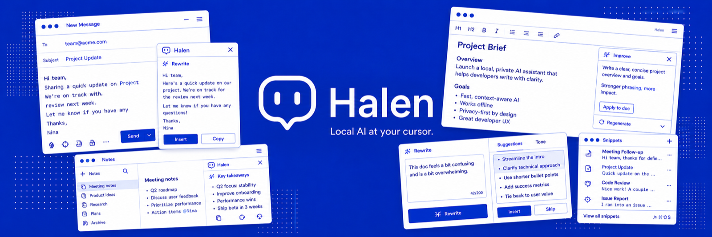

<p align="center">
  
</p>

<p align="center">
  <strong>Your local model, with plugins.</strong><br>
  No cloud. No accounts. No telemetry. Everything runs on your Mac.<br>
  <a href="https://halen.dev">halen.dev</a> · <a href="https://halen.dev/changelog.html">Changelog</a> · <a href="https://halen.dev/privacy.html">Privacy</a> · <a href="PLUGINS.md">Write a plugin</a>
</p>

<p align="center">
  <a href="https://github.com/lukataylo/halen/releases/latest"></a>
  <a href="https://github.com/lukataylo/halen/releases"></a>
  <a href="LICENSE"></a>
  
  <a href="https://github.com/lukataylo/halen/stargazers"></a>
</p>

---

Halen is a plugin platform for one on-device model. The host owns the model,
the permission layer, the hotkeys, and the storage; everything you actually
*use* — the writing assistant, voice dictation, snippet expansion, the
coding-agent dashboard in your notch — is a plugin. A plugin is a folder and
a manifest:

```json
{
  "id": "com.example.clipboard-cleaner",
  "name": "Clipboard Cleaner",
  "summary": "Press ⌃⌥⇧V to strip tracking junk from your clipboard.",
  "version": "1.0.0",
  "halenApiVersion": "0.1",
  "executable": "/usr/bin/python3",
  "args": ["plugin.py"],
  "events": ["hotkey.fired"],
  "capabilities": ["clipboard", "hotkeys", "notifications"]
}
```

That `capabilities` list is the whole trust model. Every plugin declares up
front what it observes (your text, the frontmost app, your screen, local
processes) and what it can do (insert text, show a popover, speak, run a
shortcut). The host enforces it, and one permissions screen shows every
plugin × every capability, each individually revocable. You can see exactly
what touches your text — that's the product.

## Install

[**Download Halen**](https://github.com/lukataylo/halen/releases/latest) — signed, notarized, free. Apple Silicon, macOS 14 or later.

1. Open the DMG.
2. Drag Halen to **Applications**.
3. Launch it. Grant Accessibility when asked.

Halen updates itself. You'll never need to come back to this page.

**Coming from NotchBar?** Halen absorbs it: enable the Notch Boss plugin and
your settings, Claude Code hooks, and approval socket carry over unchanged.
Quit the old NotchBar app first.

## The bundled plugins

Six plugins ship in the box. Each compiles against the same public API a
third-party plugin would use — no back doors, which is how we know the API
is honest.

| Plugin | What it does |
|---|---|
| **Writing Assistant** | Inline typo fixes, banned-term swaps, tone and clarity coaching with per-app formality targets. |
| **Snippet Expander** | `;tag` text expansion — static, dynamic (`;today`), and AI snippets that stream into place. `;reply` drafts email replies. |
| **Voice Dictation** | ⌃⌥Space, speak, on-device transcription lands at your caret. |
| **Prompt Polish** | ⌃⌥⌘P rewrites the selected prompt in place, tuned for LLMs. |
| **Mother** | A loving but firm app blocker for your focus hours. |
| **Notch Boss** | Your coding agents, live in the notch: session cards, the approval doorbell with diff preview, tool timeline, token/cost tracking, and a multi-agent file-conflict detector with an MCP coordination server. The former [NotchBar](https://github.com/lukataylo/NotchBar) app, now a plugin. |

Voice Dictation, Mother, and Notch Boss are off by default — flip them on in
the menubar. (Notch Boss turns itself on if it finds an existing NotchBar
install to inherit.)

## One model, shared

Plugins don't bundle models; they call the host's. Requests route across
whatever is available — Apple Intelligence when the OS offers it, the
bundled Gemma 4 E4B and Qwen 2.5 0.5B (llama.cpp, Metal), or your own
Ollama daemon — with one queue and two priorities, so a background
classifier never adds latency to the rewrite you're waiting on. All local,
always.

## Why local

- **Privacy** — your text is the product's input, never its export. The only
  network traffic is the daily update check and the one-time model download.
- **Speed** — the classifier answers in under 100 ms warm. No round trip
  beats no round trip.
- **Trust** — MIT-licensed, open source, and the permission layer is a
  screen, not a policy document.

## Write a plugin

Read [PLUGINS.md](PLUGINS.md). The short version: a folder, a JSON manifest,
and newline-delimited JSON-RPC over stdio in any language. The complete
example — a clipboard cleaner in ~100 lines of dependency-free Python —
lives in [`examples/clipboard-cleaner/`](examples/clipboard-cleaner/).

There is deliberately no plugin store, no submissions, no payment rails.
The plugin directory is a folder. If you build something, open an issue and
show us.

## Building from source

```bash
git clone https://github.com/lukataylo/halen.git && cd halen
./scripts/fetch-assets.sh   # llama.xcframework + the bundled model
swift build && swift test
./scripts/run-dev.sh        # build, sign for dev, relaunch with logs
```

Architecture in one breath: `Sources/HalenPluginAPI` is the public plugin
surface, `Sources/HalenKit` is the host (model lifecycle, inference queue,
permission broker, plugin runtime), `Sources/Plugins/*` are the bundled
plugins (each depends on the API target only — the compiler enforces it),
and `Sources/Halen` is the menubar shell. See `docs/wiki/architecture.md`.

## The covenant

Not on the roadmap, and probably never:

- No cloud sync. Not even opt-in.
- No online account.
- No telemetry, no analytics, no crash uploads.
- No closed-source components inside the app.
- No subscription. If that ever changes, the last free version keeps working
  and stays up.

MIT. Made for people who type all day.
