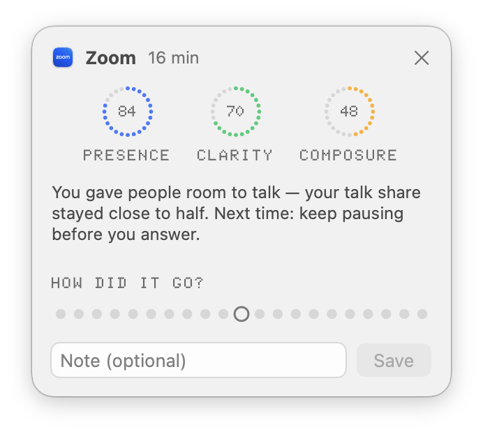
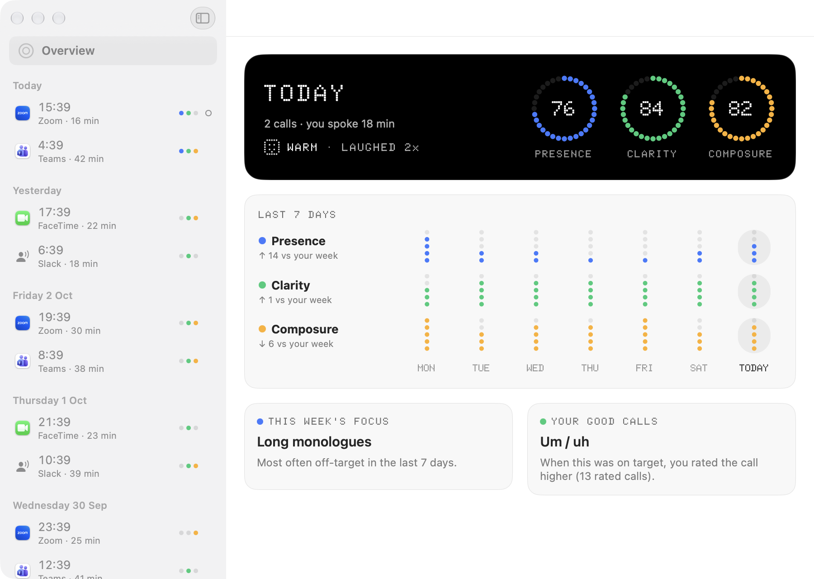

<p align="center">
  
</p>

<h1 align="center">Halen EQ</h1>

<p align="center">
  <strong>Hear how you come across on calls.</strong><br>
  A tiny Mac app that listens to your side of the conversation and tells you how it went.<br>
  Everything runs on your Mac. Audio is never saved.<br><br>
  <a href="https://github.com/lukataylo/halen/releases/download/eq-v1.0.0/HalenEQ-1.0.0.dmg"><b>Download for Mac</b></a> · <a href="https://halen.dev">halen.dev</a> · <a href="https://halen.dev/privacy.html">Privacy</a>
</p>

---

You spend hours a day on calls and almost nobody tells you how you sounded. Halen EQ sits in your menu bar, starts when Zoom, Teams, FaceTime, Slack, Discord, WhatsApp or Webex picks up the mic (and asks first for Meet in a browser), and when the call ends it gives you three numbers and one thing to try next time.

| | What it looks at |
|---|---|
| **Presence** | Do you leave room for other people? Talk share, interruptions, long monologues. |
| **Clarity** | Can people follow you? Pace, ums and uhs, how much your voice moves. |
| **Composure** | Do you stay steady when it gets tense? Measured against *your* calm voice. |

Then you drag one slider to say how the call felt. After a few calls it shows you which habits line up with the calls you felt good about.

<p align="center">
  
</p>

## Privacy

- **Your voice only.** A 30-second voice check teaches it what you sound like; anything else is wiped from memory before it's analysed. The other side of the call is never recorded. It only measures how loud they are, to know when they're talking.
- **No audio on disk.** Sound becomes numbers as it comes in, then it's thrown away.
- **Your words, only if you want.** Saving your own transcript is off by default. Turn it on and it's encrypted and deleted after 1, 7 or 30 days.
- **No account, no cloud.** The only network traffic is the daily update check, a one-time voice model download, and Apple's own speech model if macOS needs it.

## Install

[**Download Halen EQ**](https://github.com/lukataylo/halen/releases/download/eq-v1.0.0/HalenEQ-1.0.0.dmg). Free, MIT licensed. Needs macOS 26 or later on Apple silicon.

1. Open the DMG and drag **Halen EQ** to Applications.
2. Launch it. It lives in the menu bar.
3. Click **Set Up** to do the 30-second voice check. That's it.

Halen EQ checks for updates daily and asks before installing.

## Build from source

```bash
git clone https://github.com/lukataylo/halen.git
cd halen/eq
swift test                                  # 26 tests
CONFIG=debug ./scripts/bundle.sh && open .build/HalenEQ.app
open --env EQ_DEMO=1 .build/HalenEQ.app     # sample data, touches nothing real
```

Releases: `SIGN_IDENTITY=<Developer ID hash> ./eq/scripts/release.sh` builds, signs, notarizes and packages the DMG, and writes the signed update feed (`eq/appcast.xml`).

Under the hood: Apple's on-device speech recognition and Foundation Models, [FluidAudio](https://github.com/FluidInference/FluidAudio) for the voice check, Core Audio process taps for the level meter, and [Sparkle](https://sparkle-project.org) for updates. The design brief and feature list are in [`docs/EQ_FEATURES.md`](docs/EQ_FEATURES.md).

## The old Halen

Halen used to be a local-AI writing assistant. It's archived in [`archive/halen-writing`](archive/halen-writing/ARCHIVED.md), and its last release ([v0.3.0](https://github.com/lukataylo/halen/releases/tag/v0.3.0)) still works and is still downloadable.

## License

MIT. See [LICENSE](LICENSE). The dot-matrix font is [Doto](https://github.com/oliverlalan/Doto) (SIL Open Font License).
